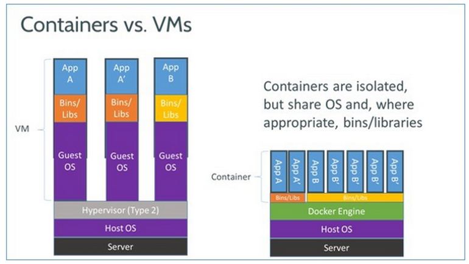

*Network Operating Systems (CEN502)*

*Docker Guide*

*Background*:

Docker is an open-platform application management tool. It works by setting up an environment in layers called containers which are created by running an image. See the below picture for a visual representation of how docker differs from conventional virtual machines.

(Vaughan-Nichols, 2018)

Compared to virtual machines Docker containers have the benefit of only using the resources needed by the running applications whereas virtual machines are assigned a set amount of resources which can be waste when not fully utilized. As Well as this they are not dependent on the system on which they are running meaning they can be implemented on any system capable of running Docker without having to fine tune each application to work on different systems.

For businesses this greatly reduces overhead when implementing a new system across different locations to multiple users running different systems.

Typically, the image Docker runs is built using a Dockerfile which utilizes simple variables to build the system. See further reading for more details.

*Command line*:

During the Acme scenario you will be required to run the preconfigured and built Docker images stored on a local server in the computer laboratory. In real-world practice the images are usually stored on the cloud but our laboratory computers do not have access to the internet.

In order to download and run the image the following command can be used:

*# pulls the docker image from its stored location.*

*$ docker pull <image name> <image location>*

*# runs the docker image.*

*$ docker run -t -i <image name> <image location>*

The following can be used to check configurations.

*# Starts docker (start can be changed to restart if its already running).*

*$ Service docker start*

*# shows a list of running images.*

*$ docker images ls*

*# shows a list of running containers.*

*$ docker container ls*

*# add ‘-a’ at the end for a list of all containers in any state.*

*# gives a list of container id’s.*

*$ docker ps -l*

*Dockerfile:*

The Dockerfile should be saves in an empty file with no extension in the name. They are not case sensitive but common practice dictates that you capitalise the variable used.

Below is a simple dockerfile example:

*FROM centos:latest # uses the latest version of CentOS pulled from the docker hub.*

*MAINTAINER tmoran/tmoran@hotmail.com # used to identify the files administrator/creator.*

*RUN yum update # updates the operating system with any missing files.*

*RUN yum install -y httpd # installs apache.*

*RUN yum install -y bind bind-utils # installs a DNS server application called bind (used in CentOS).*

*RUN yum clean all # cleans all unnecessary cache data*

*ADD <path of file on host system> <path of file on container> # copies a file from the host pc to the container.*

Many other variables can be used to add complexity to a Dockerfile. See further reading for more details.

*Further reading*:

Docker is a highly useful tool in modern computing and is being utilised frequently by companies. Devops is a well-paid role and it could provide invaluable having expertise in With this in mind it is strongly recommended that you spend your own mastering it’s many features.

Installation guide, syntax, Dockerfiles cheat-sheet - https://docs.docker.com/install/

Basic tutorial - https://docker-curriculum.com/

Basic Dockerfile tutorial - https://www.digitalocean.com/community/tutorials/docker-explained-using-dockerfiles-to-automate-building-of-images

*References*:

Vaughan-Nichols, S. (2018). _What is Docker and why is it so darn popular? | ZDNet_. [online] ZDNet. Available at: https://www.zdnet.com/article/what-is-docker-and-why-is-it-so-darn-popular/ [Accessed 28 Jun. 2018].
